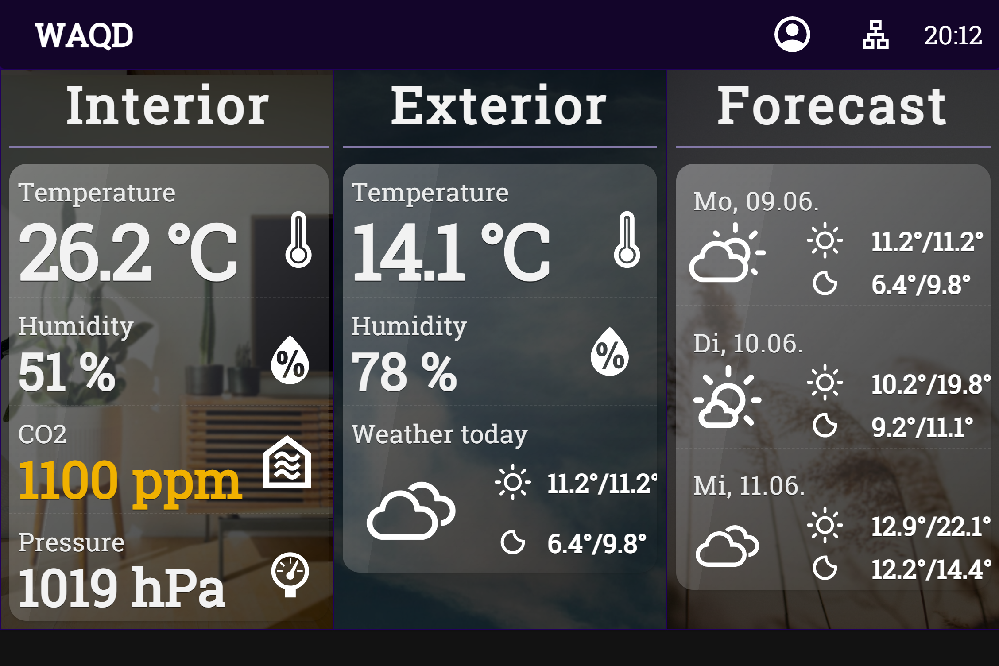
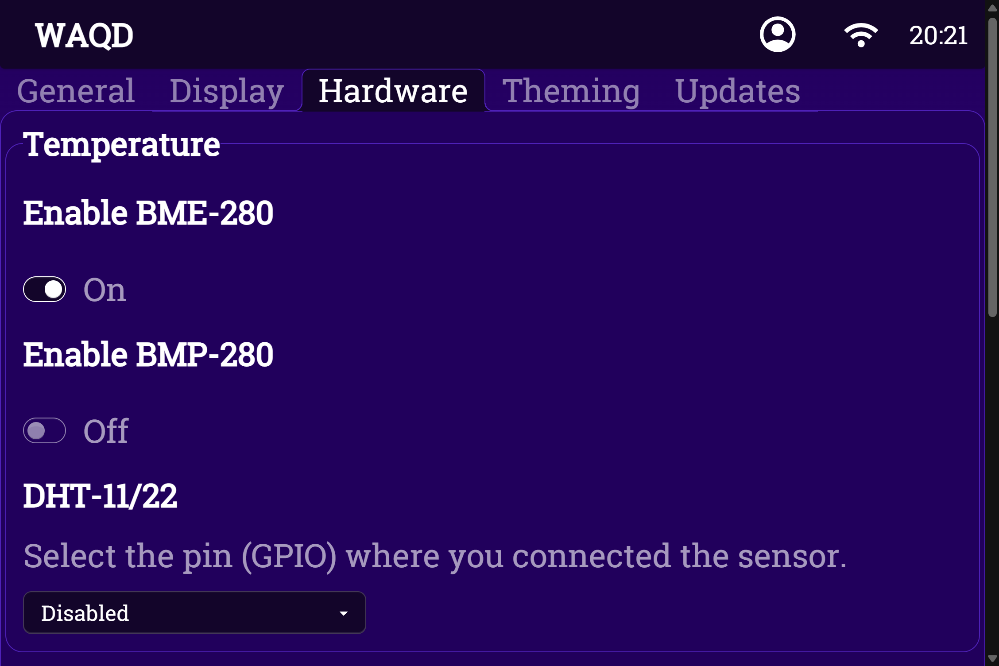
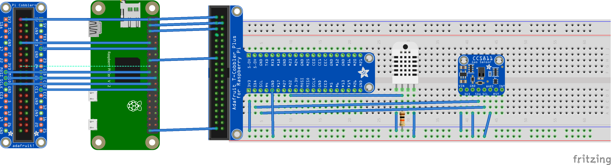

# 

Weather and Air Quality Device - based on Raspberry Pi
==================================================

Quick Overview
--------------

The goal of this project is to create a weather station for indoor use
with the use of commonly used sensors and a touch display.

The project will be written with the usage of Qt in Python.

Features
--------

# 

* Infopane witch clock and date
* Interior with sensor display
* Exterior with online or remote sensor temperature
* 3 day forecast

# 

* Options for
  * display settings
  * scaling
  * language
  * online weather settings

Hardware
--------

### Rasberry
* runs on any Raspberry, for assembly a 3B model was used

### Sensors:
* infrared motion sensor: RPI HC-SR501 (PIR) 
* air quality sensor (CO2): RPI HC-SR501
* temperature and humidity sensor: DEBO DHT 22
* 433 MHZ receiver:
* remote temperature and humidity module: 

### Display:
* official Raspberry Pi 7" touch display
* RASP PI 5TD Waveshare 

### Assembly:
* case for official Rpi touchscreen (either for RPi 3 or 4)
* PIR sensor mount
* USB power adaptor (at least ~2,5 A)

Wiring
------

# 

* HC-SR501 PIR motion sensor
  * VCC on pin 2 (5V)
  * OUT on pin 16 (GPIO 23) - arbitrary
  * GND on pin 6

* DHT22
  * VCC on pin 1 (3,3V)
  * DATA on pin 8 
  * not connected
  * GND

* CCS81

Installation on RPI:
-------------------

### Needed Libs:
* For Hardware:
  * RPI.GPIO
  * adafruit-blinka
  * adafruit-circuitpython-dht or Adafruit_DHT
  * adafruit-circuitpython-ccs811, depends on adafruit-circuitpython-lis3dh
  * LCD-show for Waveshare display
  * Raspberry 7 touchscreen: rpi-backlight
* debugpy - for remote debugging
* PyQt5 - GUI framework
  * sudo apt-get install qt5-default pyqt5-dev python3-pyqt5.qtsvg pyqt5-dev-tools
* for tts: python-vlc, gTTS

### Test airquality sensor:

    sudo i2cdetect -y 1

Slowdown baud rate with sudo nano /boot/config.txt

    dtparam=i2c_baudrate=10000

### Set up Waveshare display
https://www.waveshare.com/wiki/5inch_HDMI_LCD

    mkdir driver
    cd ./driver
    git clone https://github.com/waveshare/LCD-show.git
    cd LCD-show/
    chmod +x LCD5-show
    ./LCD5-show

### Rotate touchscreen
https://www.instructables.com/id/Rotate-Raspberry-Pi-Display-and-Touchscreen/

### Backlight for RpiTD
https://forum-raspberrypi.de/forum/thread/33548-steuerung-des-offiziellen-7-touch-lcd-mit-rpi-backlight/

## Speach

Uses google tts.

SOX:
    sudo apt-get install sox libsox-fmt-mp3

### Set backlight on Waveshare b display

    gpio -g pwm 18 1024
    gpio -g mode 18 pwm #set the pin as PWM
    gpio pwmc 1000
    gpio -g pwm 18 X #change the brightness, X ranges 0~1024

In Python it causes screen flickering, presumably because performance.

### Use 433 MHz receiver

uses rpi-rf
scripts/433MHz.py

Configure Linux
---------------

### Full update

sudo apt full-upgrade rather then  sudo apt-get upgrade

### Disable Screen auto turnoff

    sudo apt-get install xscreensaver

open settings and disable screensaver

### SplashScreen

https://scribles.net/customizing-boot-up-screen-on-raspberry-pi/

### Set language

    sudo dpkg-reconfigure locales de_DE.UTF-8
    apt-get install kde-l10n-de 
    TODO "sudo apt-get install language-pack-id" is needed...
    or sudo locale-gen

### Add to desktop

    /usr/share/applications/PiWeather.desktop
    sudo nano PiWeather.desktop

copy from scripts/

### Add to autostart

    sudo nano /home/pi/.config/lxsession/LXDE-pi/autostart

Add this to the bottom of that file

    @lxpanel --profile LXDE-pi
    @pcmanfm --desktop --profile LXDE-pi
    @xscreensaver -no-splash
    @lxterminal -e python3 /path/to/your/script.py
    @unclutter -display :0 -idle 3 -root -noevents

### Add right click for touch
or use twofinger wirh https://www.raspberrypi.org/forums/viewtopic.php?t=138575

    sudo nano /etc/X11/xorg.conf

    Section "InputClass"
    Identifier "calibration"
    Driver "evdev"
    MatchProduct "FT5406 memory based driver"

    Option "EmulateThirdButton" "1"
    Option "EmulateThirdButtonTimeout" "750"
    Option "EmulateThirdButtonMoveThreshold" "30"

### Hide mouse cursor

#edit this file:
/usr/share/lightdm/lightdm.conf.d/01_debian.conf

...below are the contents of the '01_debian.conf' file, where I've added xserver-command=X -nocursor to the end

    # Debian specific defaults
    #
    # - use lightdm-greeter session greeter, points to the etc-alternatives managed
    # greeter
    # - hide users list by default, we don't want to expose them
    # - use Debian specific session wrapper, to gain support for
    # /etc/X11/Xsession.d scripts

    [Seat:*]
    greeter-session=lightdm-greeter
    greeter-hide-users=true
    session-wrapper=/etc/X11/Xsession
    xserver-command=X -nocursor

or

sudo apt-get install unclutter

### Restart wifi

sudo systemctl restart dhcpcd
wpa_cli -i wlan0 reconfigure
hostname -I

### get RPi Model

$ cat /proc/device-tree/model
Raspberry Pi 4 Model B Rev 1.1

### Key Shortcuts
 nano ~/.config/openbox/lxde-pi-rc.xml

 Under the keyboard tag add:

<keybind key="Super_L">
    <action name="Execute">
        <command>lxpanelctl menu</command>
    </action>
</keybind>
 or to make F4 open a terminal:

<keybind key="F4">
    <action name="Execute">
        <execute>lxterminal</execute>
    </action>
</keybind>

### Set default audio device

https://www.raspberrypi-spy.co.uk/2019/06/using-a-usb-audio-device-with-the-raspberry-pi/

Development - First Steps
-------------------------

A Python installation of min. 3.7 is needed.
For an easy to use integration, it is suggested to set the Python installation on the system path.
This project is is set up to be used with Microsoft VsCodeas an IDE.
To set a minimal working environment, the following steps are necessary:

* In VsCode use the File -> Open Workspace function to open the ./.vscode/piWeather.code-workspace
* To install the recommended extensions, go left to the Extensions view and type @recommended and install the workspace recommendations
* restart VsCode and open the Workspace again

There are two launch configurations: local start for windows and attach to remote debugger for the Raspberry Pi.
The tasks are created to deploy the source files on the Raspberry.

To use Text-To-Speach in Windows, VLC needs to be on the PATH.
To edit and compile the gui get a maximum Qt 5.11 editor (e.g. https://build-system.fman.io/qt-designer-download), otherwise it breaks the format.
It is practical to set it onto the path.
PyQt5-tools could also work, but only from 5.12 onwards in the future.

Used software
-------------

* Weather Icons licensed under [SIL OFL 1.1](http://scripts.sil.org/OFL) from [http://weathericons.io](http://weathericons.io)!

Author:
-------

Copyright (c) 2020 Péter Gosztolya
