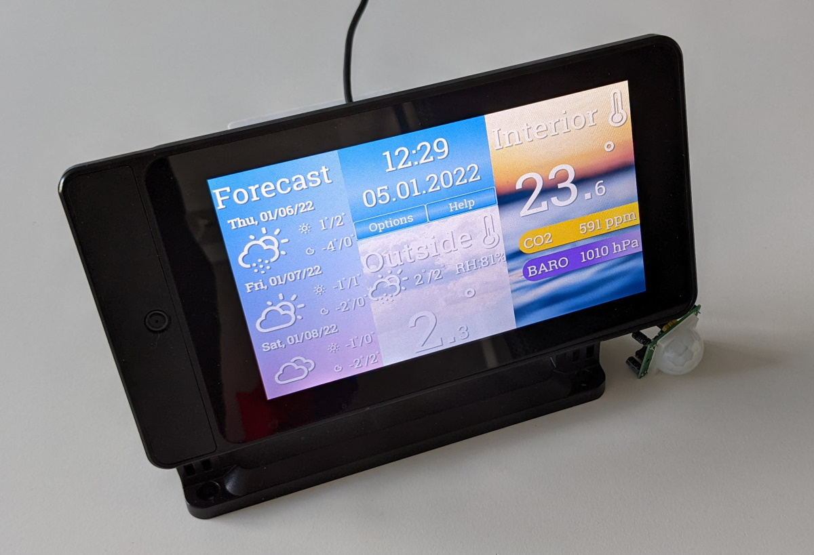

# 

# Weather and Air Quality Device - based on Raspberry Pi

## Quick Overview

The goal of this project is to create a weather station for indoor use
with the use of commonly used sensors and a touch display.

It also focuses on an easy system setup and assembly with a suited case. 

The project will be written with the usage of Qt in Python.

## Features

# 

* Info pane witch clock and date
* Interior with sensor display
* Exterior with online or remote sensor temperature
* 3 day forecast

# 

* Options for
  * display settings
  * scaling
  * language
  * online weather settings

## Supported parts

### Raspberry Pi

* theoretically all versions, but a model 2 was never tested
* model 1 runs also, but is very slow

### Case

#### SmartiPi Touch 2
* recommended because of cable management and supports all RPi Versions up to RPi4.

# 

##### Sensor holding case:

There is a 3D-printable sensor case for holding up to 4 sensors, which is optimized in size to the recommended sensors, see Adapter, Base and Lid in src/assets. It also has slits for air and hole for inserting cables.
You will need 4 M3x30 screws, and they will fit exactly on the back of the SmartiPi Touch 2 case.

# 

### Touchscreen

* Raspberry Pi original 7" capacitive Touchscreen
* Waveshare 5" resistive touch display

### Sensors

Basic
* BME280 - Temperature/Humidity/Pressure
  * very stable and has all the needed sensors
* BMP280 - Temperature/Pressure
  * same as the BME but without humidity
* DHT22 - Temperature/Humidity
  * instable driver because of pulse based connection

Air quality
* MH-Z19 - CO2
  * NDIR based CO2 sensor - pricy, but the gets very good results! 
* CCS811 - TVOC/CO2
  * measures TVOC (total volatile organic components) and only calculates an equivalent CO2 - very inaccurate readings

Motion sensor:
* PIR501 - standard part, cheap and gets the job done

Sound:
* Passive Speaker - Sound is currently only a gimmick

## Development - First Steps

A Python installation of min. 3.7 is needed.
For an easy to use integration, it is suggested to set the Python installation on the system path.
This project is is set up to be used with Microsoft VsCode as an IDE.
To set a minimal working environment, the following steps are necessary:

* In VsCode use the File -> Open Workspace function to open the ./.vscode/waqd.code-workspace
* To install the recommended extensions, go left to the Extensions view and type @recommended and install the workspace recommendations
* restart VsCode and open the Workspace again

There are two launch configurations: local start for windows and attach to remote debugger for the Raspberry Pi.
The tasks are created to deploy the source files on the Raspberry.

To use Text-To-Speech in Windows, VLC needs to be on the PATH.
To edit and compile the GUI get a maximum Qt 5.11 editor (e.g. https://build-system.fman.io/qt-designer-download), otherwise it breaks the format.
It is practical to set it onto the path.
PyQt5-tools could also work, but only from 5.12 onwards in the future.

Use virtualenv:

    python3 -m venv python

## Instal with dev mode

  pip install -e .[dev,test]

## Performance Profiling

https://github.com/dfeneyrou/palanteer/releases

    python -m palanteer -c -m waqd

## Included 3rd-Party Assets

* Weather Icons licensed under [SIL OFL 1.1](http://scripts.sil.org/OFL) from https://github.com/erikflowers/weather-icons)
* Franzo Font under [Apache 2.0](https://www.apache.org/licenses/LICENSE-2.0) from https://fontlibrary.org/en/font/franzo
* introgui by pera under [CC0 1.0](https://creativecommons.org/publicdomain/zero/1.0/legalcode) from https://freesound.org/people/pera/sounds/56231/#
* Using icons by https://icons8.com under [Universal Multimedia Licensing Agreement for Icons8](https://icons8.com/vue-static/landings/pricing/icons8-license.pdf)
* Images from Unsplash under [Unsplash license](https://unsplash.com/license) from https://unsplash.com
  * https://unsplash.com/photos/VjMJmwZOs9M from Jesse Borovnica
  * https://unsplash.com/photos/GLf7bAwCdYg from Adrian Infernus
  * https://unsplash.com/photos/pbxwxwfI0B4 from Anandu Vinod
  * https://unsplash.com/photos/dkQGYygMcrQ from Azfan Nugi
  * https://unsplash.com/photos/Z9Ds4w141i4 from Annie Spratt
  * https://unsplash.com/photos/v9bnfMCyKbg from Billy Huynh
  * https://unsplash.com/photos/i8cBWhrajKs from Bobby Stevenson
  * https://unsplash.com/photos/6tfO1M8_gas from  Chris Lawton
  * https://unsplash.com/photos/cs_WcGkz5IM from  Crina Parasca
  * https://unsplash.com/photos/pv2ZlDfstXc from Inge Maria
  * https://unsplash.com/photos/0ZC4VRG2Vhg from Ira Avtukhova
  * https://unsplash.com/photos/cIEpVluspZc from Javier Esteban
  * https://unsplash.com/photos/tCX_vAa7Um8 from Mathieu Bigard
  * https://unsplash.com/photos/ve-R7PCjJDk from Nick Nice
  * https://unsplash.com/photos/NpF9JLGYfeQ from Shot by Cerqueira
  * https://unsplash.com/photos/NkQD-RHhbvY from Sharon McCutcheon
  * https://unsplash.com/photos/bWtd1ZyEy6w from Valentin Muller
  * https://unsplash.com/photos/HxKgk_MpHMM from Zoltan Tasi
  * https://unsplash.com/photos/w8hWTFpGtpY from Chandler Cruttenden
  * https://unsplash.com/photos/_SnPaOUxO2k from Annie Niemaszyk
  * https://unsplash.com/photos/06qZZZNfzD8 from Scott Webb
  * https://unsplash.com/photos/n2poVQijgzo from Zuzana Ruttkay
  * https://unsplash.com/photos/a-turtle-swimming-in-water-ZcMUiZuOirY
  * https://unsplash.com/photos/the-sun-is-shining-through-the-clouds-in-the-sky-Ozlzi3DXuGg
  * https://unsplash.com/photos/rain-moving-into-western-loudoun-county-virginia-s-S3J8wDAoM
  * https://unsplash.com/photos/low-angle-photography-of-clouds-KOnl4LFvwHE

## Used software

* For all natively installed Python libs see setup.py
* pipx from PyPi [MIT License](<http://opensource.org/licenses/mit-license.php>)
* Python packages installed via system package manager
  * PyQt5 (including python3-pyqt5.qtsvg python3-pyqt5.qtchart) by Riverbank Computing Limited, [GPLv3](https://www.gnu.org/licenses/gpl-3.0.en.html)
  * python3-libgpiod
  * python3-venv
* wifi-connect under [Apache 2.0](https://www.apache.org/licenses/LICENSE-2.0) from https://github.com/balena-os/wifi-connect
## Needed Operating System and builtin dependencies

* Raspberry Pi OS - 64 bit (Bullseye) - 32 bit no longer supported
  * APT
  * LightDM desktop manager
  * XFCE desktop environment with pcmanfm
  * Plymouth for boot screen customization
  * raspi-config
  * Python 3.9
  * Installed official apt packages
    * feh
    * zenity
    * xdotool
    * wmctrl
    * xscreensaver
    * unattended-upgrades
## Author:

Copyright (c) 2022 Péter Gosztolya and contributors.
